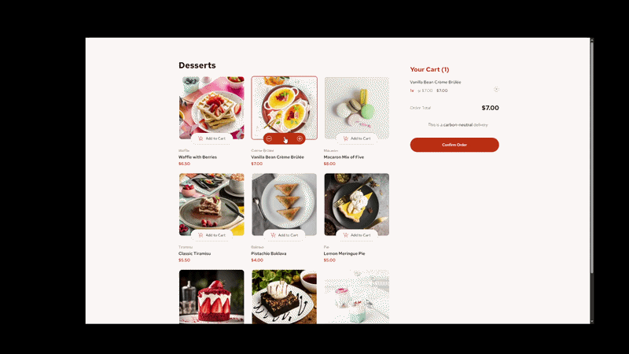

# 🛒 Product Shopping Cart

**Responsive shopping cart interface built with React**

[ Front End Mentor Challenge](https://www.frontendmentor.io/challenges/product-list-with-cart-5MmqLVAp_d)
<br>
[ View Live Solution](https://product-list-with-cart-react0.netlify.app)

---



## Overview

This project was built to practice core React concepts including state management, derived data, and component communication.
The cart state is managed centrally and shared between components to ensure the UI stays synchronized when items are added, removed, or updated.

---


## Features

- **Product List Rendering** – Product items loaded from a JSON data source and dynamically rendered
- **Cart State Management** – Add, remove items, update quantities, and view totals
- **Order Modal** – Confirmation UI with full cart summary and reset logic
- **Responsive Layout** – Uses `<picture>` for responsive images and em-based breakpoints.
- **React Hooks** – `useState` for state management and `useEffect` used for side effects.

---

## How It Works

- Cart state is owned by the top level `App` component and passed down to child components via props. This ensures a single source of truth.
- When an item is added, the cart checks if it already exists and either increments the quantity or adds a new entry.
- Order total is derived from cart state rather than stored separately.
- The confirmation modal visibility is controlled via state.
- A side effect locks body scroll when the modal is open using `useEffect`.

## Tech Stack

- React 19
- Vite
- SCSS
- JSON (data)

---

## 🧠 Reflections

This project reinforced the importance of deriving UI from state rather than manipulating the DOM directly.

I used `useEffect` in two key scenarios:

- to handle UI side effects such as locking body scroll when the modal is open.
- Recalculating order total whenever cart state changes to keep derived values in sync.

This helped me better understand how React separates rendering logic from side effects.

## Component Structure

App
├── ProductList
│ └── ProductCard
├── Cart
└── Modal

## Run Locally

```bash
npm install
npm run dev
```
